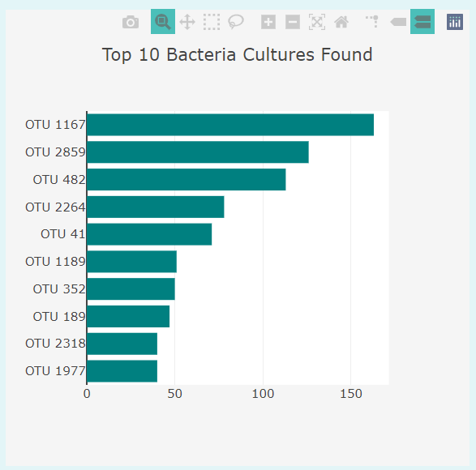
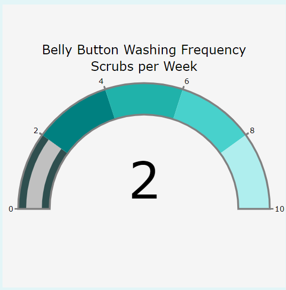
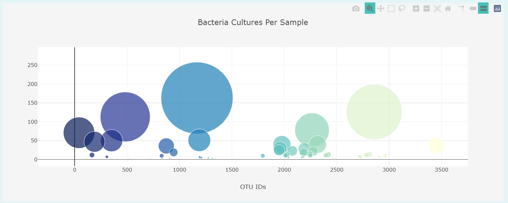
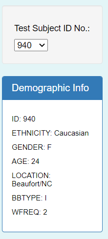

# Belly Button Biodiversity

## Overview

This project has been designed to complete a [website](https://www.google.com "Google's Homepage") to visualize data from a belly button biodiversity research study. The study was conducted to analyze different bacteria found in belly buttons. Volunteer participants had their belly buttons swiped to gather data. 

## Results

### Website Visualization Tools
The website visualizes the biodiversity of the bacteria found in the participant's belly buttons. It showcases the data in various charts:

- Bar Chart: *Top 10 Bacteria Cultures Found*

- Gauge Chart: *Belly Button Washing Frequency Scrubs per Week*

- Bubble Chart: *Bacteria Per Sample*

### Choosing Data 
Website visitors are able to choose from the data set of each individual volunteer participant.  This can be done by choosing a *Study ID* number from the drop down menu.

### Website Modifications
To fullfill the requirements of this unit, the website was modified with additional paragraphs explaining each section, it was colour coordinated, a background photo in the *Jumbatron* section was added, and a navigation bar was included to quickly jump to either chart. 

